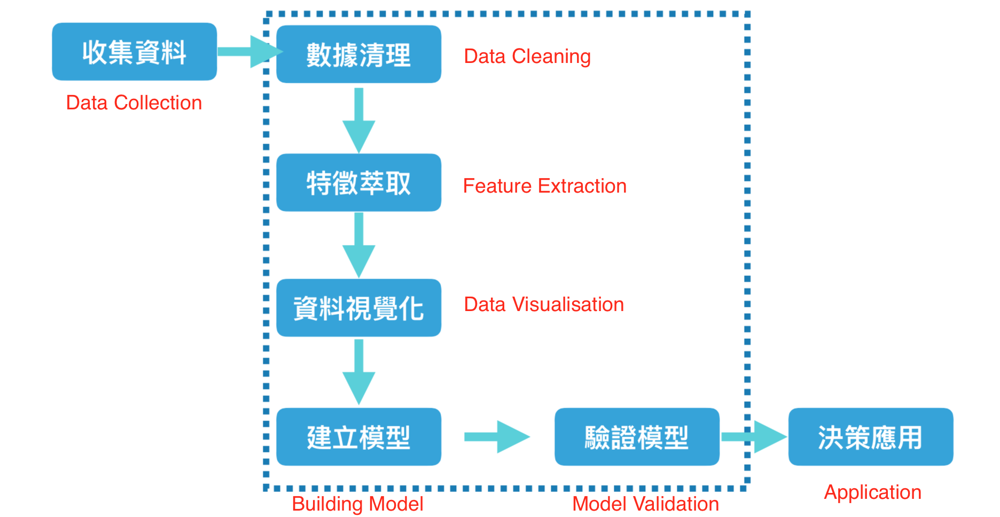
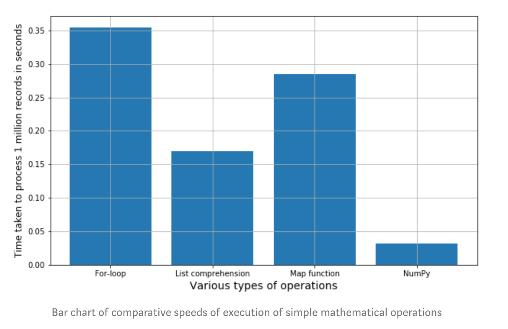

# 100 Days Note

* Day1-13: Data Preprocessing
  
  Day14- 32: EDA-Feature Importance
  
  Day33-50: Supervised Learning
  
  Day54-62: Unsupervised Learning (PCA, T-SNE)
  
  Day63- : Deep Learning


* Day 1
  
  * Discovery journey
    * Find the problem -> prototype solution -> improve -> sharing -> practice -> participate competition
  
* Day2
  * Three types of ML
    * Supervised Learning, Unsupervised Learning, Reinforcement Learning
  
* Day3
  * ML Process	
    * Preprocessing: missing value, outlier, standardisation
    * Define goal: regression/classification problem, predictor and target value
    * Evaluation: regression -> RMSE, MAE, R-square; classification -> Accuracy, F1 score, AUC
    * Build and Tune Model

* Day4

  * Explore Data Analysis (EDA)

    

* Day5

  * Read and write file

  * `ndarray`, a fast and space-efficient multidimensional array providing vectorized arithmetic operations

    

* Day6
  * Data Preprocessing
  * Label Encoding vs One hot encode
  
* Day7

  * Variable types: numerical & categorical

* Day8

  * EDA
    * mean, median, mode
    * min, max, range, quartiles, variance, standard deviation

* Day9
  * Outlier
    * How to check?
      * check summary statistics (avg, sd, median, IQR)
      * plot: boxplot for univariate feature and scatterplot for multivariate
    * How to deal with outlier: replace with median/average, delete all columns, create new columns, etc

* Day10
  * Outlier with code two methods
    * change the range (set min and max and force the outlier to be min value or max value)
    * directly exclude the data
  
* Day11
  * whether we should normalise the continuous data?
    * For regression model: affect
    * For tree-based model: no effect
  
* Day12
  * standard scaler vs minmax scaler
    * standard scaler -> not easy influence by outlier
    *  minmax scaler -> easy influence by outlier -> suitable for data already deal with outlier
  
* Day13
  * Dataframe manipulation
    * column to row: pd.melt(df)
    * row to column: pd.pivot()
    * regex filter: `df.filter(regex=)`
  
* Day14 EDA
  * Correlation Coefficient: -1~1 and measure two random variables linear relationship
    * use scatter plot to visualise the relationship
  * np.corrcoef
  
* Day15 
  * Correlation
  * df.corr()
  
* Day16 
  * Kernel density estimation -> computation intensive
  * plt.style.use(‘default’) # 不需設定就會使⽤用預設
    plt.style.use('ggplot')
    plt.style.use(‘seaborn’) # 或採⽤用 seaborn 套件繪圖
  * [Python graph gallery](<https://python-graph-gallery.com/>)
  * [KDE vs Histogram](<https://blog.csdn.net/unixtch/article/details/78556499>)
    * Histogram will bias if the bin setting is not accurate -> KDE no this issue
    * Histogram distribution is not smooth

* Day17 Discretising (連續型變數離散化)

  * reduce the impact of outlier
  * 等寬劃分: pd.cut
  * 等頻劃分: pd.qcut

* Day18 Discretising

  * discretising + groupby to see the trend

* Day19 Subplot

  * sns.jointplot

* Day20 Pairplot, Heatmap

  * sns.pairplot(df, hue = 'continent')

* Day21 Logistic Regression

  * remove column appear in test not train -> app_train, `app_test = app_train.align(app_test, join = 'inner', axis = 1)`

* Day22 Feature Engineer

  * count encoding -> sensitive to outlier

  * label count encoding -> not sensitive to outlier and also rank category by count (combination of label encoding and count encoding)

  * target encoding ->  Encode categorical variables by their ratio of target -> avoid overfit

  * box-cox transformation -> solve normality problems (non-normal data)

    

  

  

  

* Day23 Remove Skewness (example: [box-cox](https://github.com/chloe0730000/100_Days_ML_Marathon/blob/master/Lecture_Code/Day_023_Reduce_Skewness.ipynb))
  * purpose of remove skewness -> make the distribution toward normality
  * Methods: take log, sqrt, boxcox
    * Boxcox: 使⽤用 box-cox 分布去偏時，除了了注意 λ 參參數要介於 **0**
      到 **0.5** 之間 (0=log transform, 0.5 = sqrt)，並且要注意轉換前的數值不可⼩小於等於 **0** (if <=0, then add 0.01-1 to original value) -> [example](https://github.com/chloe0730000/100_Days_ML_Marathon/blob/master/Homework/Day_023_HW.ipynb)

* Day24 Categorical variables processing - label encoding and one-hot encode

  * auto generate mapping code: 

    class_mapping = {label:idx for idx,label in enumerate(set(df['class label']))}

  * one hot encoding / label encoding

  * Tree model no need use one hot encode using label encoding is enough since they don't treat number as ordering (ex:2>1)

  * Logistic regression: one hot encoding better; GradientBoostingRegressor/linear regression: label encoding -> but different dataset might have diff results

  * Pros and Cons

    

* Day25 Categorical variables processing - Mean encoding ([example]([http://localhost:8888/notebooks/Documents/GitHub/100_Days_ML_Marathon/Lecture_Code/Day_025_Mean_Encoder.ipynb](http://localhost:8888/notebooks/Documents/GitHub/100_Days_ML_Marathon/Lecture_Code/Day_025_Mean_Encoder.ipynb)))
  * 我们可以尝试使用**平均数编码（mean encoding）**的编码方法，在贝叶斯的架构下，利用所要预测的应变量（target variable），有监督地确定最适合这个定性特征的编码方式。在Kaggle的数据竞赛中，这也是一种常见的提高分数的手段。
  * when to use: when the variable highly correlated with the target or when a variable that has many categories
  * powerful encoding methods but probably will overfit (use smooth methods) -> use cross validation check score

* Day 26  Categorical variables processing - Count encoding, feature hash

  * 計數編碼是計算類別在資料中的出現次數，當⽬目標平均值與類別筆數呈正/負相關時，可以考慮使⽤用
  * Can apply together with label encoding
  * 觀察欄位相異值數量:`df.select_dtypes(include=["object"]).apply(pd.Series.nunique)`

* Day27 Time series features ([example](https://github.com/chloe0730000/100_Days_ML_Marathon/blob/master/Lecture_Code/Day_027_DayTime_Features.ipynb))

  

  

  * strptime (將⽂文字解析成時間物件), strftime (轉出時間物件各欄欄位成⽂文字) for datetime package
    * datetime.datetime.now().strftime("%Y-%m-%d %H:%M:%S") -> change to string
    * datetime.datetime.strptime("2014-12-31 18:20:10", "%Y-%m-%d %H:%M:%S") -> change to datetime format

* Day28 特徵組合 (數值與數值)

  * Feature cross to solve "nonlinear" problem
  * Create relevant features which are able to make model perform better
  
* Day29 特徵組合 (數值與類別)

  *  群聚編碼 -> groupby mean, max, median, count

* Day30 Feature Selection

  * Methods
    * Filter: ex: for features' correlation coefficient less than cetrain threshold will be filtered out
    * Wrapper
    * Embedded: use ML methods ex: Lasso, GDBT, XGBOOST, permutation, RandomForestRegressor

  

* Day31 Feature Importance for tree based methods / [Permutation Importance](<https://www.kaggle.com/dansbecker/permutation-importance?utm_medium=email&utm_source=mailchimp&utm_campaign=ml4insights>) for all ML models

  * 樹狀模型的特徵重要性：分支次數, 特徵覆蓋度, 損失函數降低量
  * sklearn 樹狀狀模型與 Xgboost 的特徵重要性，最⼤大差異就是在 **sklearn** 只有精準度最低的「分⽀支次數」

  

  ```python
  for c in df.columns:
      df[c] = df[c].fillna(-1)
      if df[c].dtype == 'object':
          df[c] = LEncoder.fit_transform(list(df[c].values))
      df[c] = MMEncoder.fit_transform(df[c].values.reshape(-1, 1))
  ```

* Day32 Leaf encoding (example code: [GDBT+LR]([http://localhost:8888/notebooks/Documents/GitHub/100_Days_ML_Marathon/Lecture_Code/Day_032_Leaf_Encoding.ipynb](http://localhost:8888/notebooks/Documents/GitHub/100_Days_ML_Marathon/Lecture_Code/Day_032_Leaf_Encoding.ipynb)), [RF+LR]([http://localhost:8888/notebooks/Documents/GitHub/100_Days_ML_Marathon/Homework/Day_032_HW.ipynb](http://localhost:8888/notebooks/Documents/GitHub/100_Days_ML_Marathon/Homework/Day_032_HW.ipynb)))

  * 葉編碼 (leaf encoding) 顧名思義，是採⽤用決策樹的葉點作為編碼依據重新編碼  	

    

  * 實際結果也證明，在分類預測中使⽤用樹狀狀模型，再對這些擬合完的樹狀狀模型進⾏行行葉編碼+邏輯斯迴歸，通常會將預測效果再進⼀一步提升  					 				 			 	
  
* Day33 How machine Learn?

  * Overfit problem

  

  * 決策樹模型就是個非常容易過擬合的模型，必須透過適當的正規化來來緩解過擬合的情形

* Day34 Train test split

  * train_test_split, k_fold

* Day35 Regression vs Classification

* Day36 Evaluation Metric

  * Regression: Mean absolute error, mean square error, R-square
  * Classification: AUC, F1 (Precision, Recall)
  
* Day37 Regression

  * Linear Regressions
    * Need to avoid multicollinearity, standardisation
    * Model baseline
  * Logistic Regression
    * Classification model
    * sigmoid function makes the output results between 0 and 1

* Day38 Regression
  * Logistic Regression
    * Penalty: L1,L2
    * C : 正則化的強度，數字越⼩，模型越簡單
    * Solver : 對損失函數不同的優化⽅方法

* Day39 Lasso/Ridge
  * Loss function: 衡量量預測值與實際值的差異異，讓模型能往正確的⽅方向學習
  * Regularization: 避免模型變得過於複雜，造成過擬合 (Over-fitting)
  * Lasso -> L1 Regularisation; Ridge -> L2 Regularisation
  * Lasso can be used as feature selection tools
  * α=0则和原来的损失函数是一样的，如果α=∞，则损失函数只有正则项，此时其最小化的结果必然是w=0

* Day40 Lasso/Ridge
  * if no overfitting, then no need to use Lasso or ridge since they have penalty term called alpha to control overfitting
  * 當自變數 (X) 存在高度共線性時，Ridge Regression 可以處理這樣的問題嗎? 可以。Ridge Regeression 就是透過 L2 進行權重的 decay，進而減少特徵的共線性帶來的 Over-fitting 情形。後面的課程會提到一種非監督室的方法叫做 PCA, Principal Component Analysis 主成分分析，是一種用來消除特徵具有共線性的方法，而 Ridge Regression 有些地方其實與 PCA 非常類似。
  
* Day41 Tree based model
  * Decision Tree
    * split the tree by finding the max information gain feature
    * easy to interpret if the tree not so large
    * 如果不對決策樹進行限制，決策樹是可以為每一個訓練樣本找到其對應的規則，就能夠把訓練 loss 降為 ０
    * 決策樹同樣可以用來做回歸問題，這時評量資料相似程度則會用該群的平均數為每個值計算差距，可以想像標準差要是越小，該群中的樣本越相似
  * Random forest
    * Ensemble learning, less chance to get overfit
  
* Day42

  * [Visualisation decision tree](<https://medium.com/@rnbrown/creating-and-visualizing-decision-trees-with-python-f8e8fa394176>)

* Day43 Random Forest

  * 若若不對決策樹進⾏行行限制 (樹深度、葉⼦子上⾄至少要有多少樣本等)，決策樹非常容易易 Overfitting
 
  * Random Forest
    * Ensemble learning
    * 隨機森林林的每⼀一棵樹在⽣生成過程中，都是隨機使⽤用一部份的訓練資料與特徵
代表每棵樹都是⽤隨機的資料訓練⽽而成的

* Day44 Random Forest

  *  隨機森林林是個集成模型，透過多棵複雜的決策樹來來投票得到結果，緩解原本決策樹容易易過擬和的 問題，實務上的結果通常都會比決策樹來來得好
  * 隨機森林使用的集成方法稱為 Bagging (Bootstrap aggregating)，⽤抽樣的資料與 features 生成每⼀棵樹，最後再取平均  			

* Day45 Gradient Boosting Machine (ex: XGBoost, LGBM)

  * Boosting 則是另⼀種集成方法，希望能夠由後⾯生成的樹，來修正前面樹學不好的地方 -> 怎麼修正前⾯學錯的地⽅呢? 計算 Gradient!		

* Day46  Gradient Boosting Machine		 	

  * [Reference of application](https://www.analyticsvidhya.com/blog/2016/02/complete-guide-parameter-tuning-gradient-boosting-gbm-python/) -> include the grid search detail guide

* Day47 Parameter Tuning

  *  超參數會影響結果，但提升的效果有限，資料清理與特徵⼯程才能最有效的  提升準確率，調整參數只是一個加分的工具  	
  * Grid search & Random search			
  
* Day49 Ensemble -> Bagging, boosting, blending, stacking

  	

  * Blending
    * 將不同模型的預測值加權合成
    * Blending 的前提是 : 個別單模效果都很好(有調參)並且模型差異異⼤，單模要好尤其重要，如果單模效果差異太大，Blending 的效果提升就相當有限

* Day50 Stacking

  * 使⽤預測結果當新特徵

    

  * 能不能新舊特徵⼀起用，再用模型預測呢? 可以，這裡其實有個有趣的思考，也就是 : 這樣不就可以一直⼀直無限增加特徵下去? 這樣後⾯的特徵還有意義嗎? 不會 Overfitting 嗎?...其實加太多次是會 Overfitting 的，必需謹慎切分 Fold 以及新增次數

  * 「分類問題」的 Stacking 要注意兩件事:記得加上 use_probas=True(輸出特徵才會是機率值)，以及輸出的總特徵數會是:模型數量*分類數量(回歸問題特徵數=模型數量) 

* Day54 Clustering

  * 監督式學習⽬目標在於找出決策邊界; Clustering 的目標在於找出資料結構					 				 			 

  * Use case: customer segmentation, market basket analysis, topic modelling

* Day55 K-means
  * Objective: minimize the within cluster sum of square
  * Random initialisation: initial 設定的不同,會導致得到不同clustering的結果,導致local optima而非 global optima
  * Need to scale the variables
  
* Day56 silhouette_score (輪廓係數)
  * score close to 1 is the best -> 分離度和內聚度相對較優
  * score close to 0 or -1 the worse -> 聚類效果不好 因為組內相似度<<組間相異度

* Day57 Hierarchical Clustering
  * 只適用於少量資料,大量資料會很難處理
  * Need to scale the variables
  
* Day59 PCA
  * PCA 可以把highly correlated features 移除
  * Proportion Variance Explained by each principal component -> between 0 and 1
  * How many principal components to use? -> scree plot find the elbow
  * 在維度太⼤發生 overfitting 的情況下，可以嘗試用PCA 組成的特徵來做監督式學習，但不建議一開始就做
  
* Day61 T-sne
  * PCA 是⼀種線性降維⽅式，因此若特徵間是非線性關係 (文字、影像)，會有underfitting 的問題 -> 可以考慮用t-sne 但是執行時間會比較久
  * Perplexity 越高 -> 分群效果越好但是要執行更久
  
* Day62 T-sne
  
* 流形還原就是在高維度到低維度的對應中，盡量保持資料點之間的遠近關係，沒有資料點的地⽅，就不列入考量範圍

  
* Day63 Deep Learning

  

  * CNN (Convolutional Neural Network): CNN 參考像素遠近省略神經元，並且⽤影像特徵的平移不變性來來共用權重，⼤幅減少了影像計算的負擔 
  * RNN (Recurrent Neural Network): 只要資料是有順序性的應用，都可以使用 RNN 來計算，近年在自然語言處理 **(NLP)** 上的應⽤反⽽成為⼤宗

* Day64 

  * 類神經網路： 要解决比较复杂的问题，要么增加深度，要么增加宽度，而增加宽度的代价往往远高于深度

* Day65

  * 批次(Batch Size)⼤⼩越⼩ : 學習曲線越不穩定、但收斂越快
  * 學習速率越大 : 學習曲線越不穩定、但收斂越快，但是與批次⼤⼩不同的是 - 學習速率⼤於一定以上時，有可能不穩定到無法收斂
  * 當類神經網路路層數不多時，啟動函數 Sigmoid / Tanh 的效果比 Relu 更更好
  * L1 / L2 正規化在非深度學習上效果較明顯，⽽正規化參數較⼩才有效果

* Day66 Keras installation

* Day67 Keras dataset playing